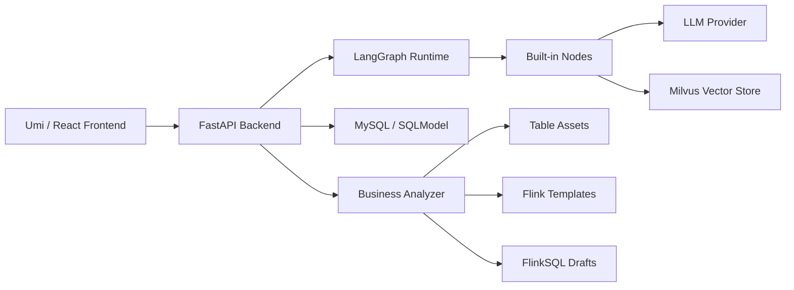
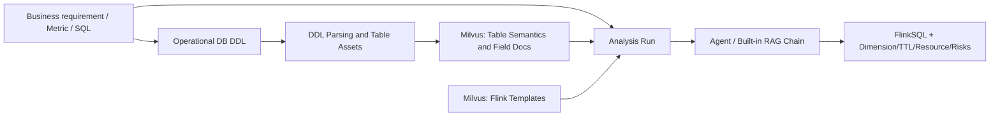

# HelixFlow

[简体中文](README.md) | English

HelixFlow is a visual Agent workflow platform for data engineers and AI application developers. It provides drag-and-drop workflow orchestration, a LangGraph-based execution engine, node-level debugging, and a FlinkSQL business analysis generator for real-time data scenarios.

## Highlights

- Visual Agent workflow orchestration: build chains such as `knowledge -> call_model -> end` with nodes and edges.
- LangGraph runtime: graph compilation, execution, pause, resume, state inspection, and node output debugging.
- Built-in nodes: LLM calls, knowledge retrieval, conditional routing, end nodes, and extensible custom operators.
- Milvus knowledge base: ingest and retrieve table semantics, field descriptions, business rules, SQL examples, and Flink templates.
- Business Analyzer: convert business requirements and operational database DDL into table assets and Kafka-first FlinkSQL drafts.
- Table asset management: parse MySQL, Oracle, Dameng, and TDSQL DDL; maintain fields, primary keys, event time, dimension-table settings, and TTL.
- FlinkSQL generation: generate CREATE TABLE and INSERT SQL from recalled Kafka, upsert-kafka, Hudi, or Hive templates.
- Engineering console UI: workflow canvas, node library, configuration panel, execution logs, SQL preview, and risk checks.

## Use Cases

- Build and debug RAG-based Agent workflows quickly.
- Maintain internal table assets, field semantics, and Flink connector templates.
- Generate real-time FlinkSQL drafts from business metrics, SQL, or operational database DDL.
- Help data engineers, analytics engineers, and business analysts collaborate around one workflow surface.

## Architecture



```text
HelixFlow
├── main.py              # FastAPI application entrypoint
├── router/              # HTTP API routes
├── core/                # Graph, node, field, and state abstractions
├── service/             # Runtime services and business analysis logic
├── database/            # SQLModel models and database session setup
├── init.sql             # MySQL schema bootstrap
├── tests/               # Backend test cases
└── web/                 # Umi / React frontend
```

## Tech Stack

| Layer | Technology |
| --- | --- |
| Backend | FastAPI, SQLModel, LangGraph, LangChain |
| Frontend | Umi, React, Ant Design, React Flow |
| Storage | MySQL |
| Vector Store | Milvus |
| Runtime | Python, Node.js, Yarn |

## Requirements

- Python 3.10+. Local development is recommended with Python 3.10 or 3.12.
- Node.js 18+.
- Yarn 1.x.
- MySQL 8.x.
- Milvus standalone, optional and only required for retrieval and business-analysis RAG.

## Quick Start

### 1. Clone

```bash
git clone https://github.com/HelixFlow/HelixFlow.git
cd HelixFlow
git submodule update --init --recursive
```

### 2. Initialize MySQL

If the MySQL client is installed locally:

```bash
mysql -u root -p < init.sql
```

If MySQL runs in Docker:

```bash
docker exec -i <mysql_container_name> mysql -u root -p < init.sql
```

`init.sql` creates the `helix` database and the tables required for workflows, users, table assets, and business-analysis runs.

### 3. Start the Backend

```bash
pip install -r requirements.txt
python main.py
```

Default backend URL:

```text
http://127.0.0.1:11110
```

Health check:

```bash
curl http://127.0.0.1:11110/helixflow/health
```

If your database credentials differ from the defaults, configure them with environment variables:

```bash
export APP_TABLE_HOST=127.0.0.1
export APP_TABLE_PORT=3306
export APP_TABLE_USERNAME=<your_mysql_user>
export APP_TABLE_PASSWORD=<your_mysql_password>
python main.py
```

### 4. Start the Frontend

```bash
cd web
yarn
yarn setup
HOST=127.0.0.1 PORT=8000 yarn dev
```

Open:

```text
http://127.0.0.1:8000
```

The frontend proxies `/helixflow` requests to `http://127.0.0.1:11110`.

## Business Analyzer Workflow

The Business Analyzer targets real-time data warehouse and FlinkSQL generation workflows. The default design is Kafka first:



Basic flow:

1. Enter a business requirement and paste operational database DDL in the Business Analyzer page.
2. Choose the DDL dialect, such as MySQL, Oracle, Dameng, or TDSQL.
3. Parse the DDL and inspect field types, primary keys, event time, and risk hints.
4. Save the table asset, or reuse an existing table asset.
5. Configure Milvus, model name, Base URL, and API Key. API Keys are runtime inputs and must not be committed to Git.
6. Ingest table assets and Flink templates into the knowledge base.
7. Run analysis and review candidate tables, template hits, CREATE TABLE SQL, INSERT SQL, dimension-table plan, TTL plan, resource suggestions, and risks.

## Main APIs

All APIs are prefixed with `/helixflow`.

| API | Description |
| --- | --- |
| `GET /helixflow/health` | Backend health check |
| `POST /helixflow/assets/ddl/parse` | Parse operational database DDL |
| `GET /helixflow/assets/tables` | List table assets |
| `POST /helixflow/assets/tables` | Save a table asset |
| `PATCH /helixflow/assets/tables/{id}` | Update a table asset |
| `DELETE /helixflow/assets/tables/{id}` | Delete a table asset |
| `POST /helixflow/knowledge/ingest` | Ingest table assets, business rules, or Flink templates into Milvus |
| `POST /helixflow/business-analysis/runs` | Create a business-analysis run |
| `POST /helixflow/business-analysis/runs/{run_id}/select-tables` | Regenerate after selecting candidate tables |

## Testing

Backend business-analysis tests:

```bash
python -m pytest tests/test_business_analysis.py
```

Frontend build check:

```bash
cd web
yarn build
```

## Configuration and Security

Do not commit:

- Real API keys.
- Production database usernames or passwords.
- JWT or other signing secrets.
- Local IDE settings.
- `.DS_Store`, logs, caches, build outputs, and dependency directories.

Model nodes, knowledge nodes, and the Business Analyzer all support API Key, Base URL, and model-name inputs at runtime. Prefer environment variables or local runtime configuration for sensitive information.

## Development Notes

- The backend entrypoint is `main.py`.
- The API prefix is `/helixflow`.
- The frontend app lives in `web/`.
- If `web` is tracked by the parent repository as a submodule or nested repository, commit the frontend repository and the parent repository pointer separately.
- Milvus is required only for knowledge retrieval, table semantic recall, and Flink template recall.

Recommended startup order:

1. Start MySQL.
2. Start Milvus if RAG is needed.
3. Start the backend.
4. Start the frontend.

## Roadmap

- More built-in Agent operators.
- MCP node support.
- Database Agent nodes.
- FlinkSQL validation and job submission.
- Yarn, S3, Hudi, and Hive environment integration.
- Image generation operators and multimodal workflows.

## Acknowledgements

HelixFlow uses and benefits from LangGraph, LangChain, FastAPI, Umi, React Flow, Ant Design, and Milvus.

Logo design reference from NextUI:

https://www.nextui.cc/#/home
