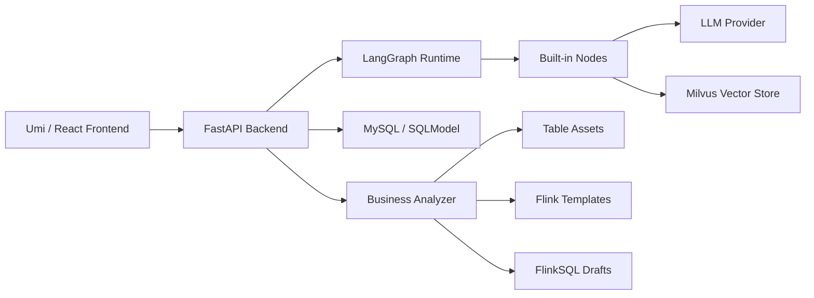
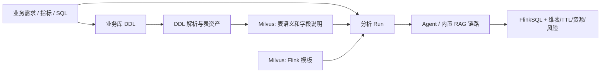

# HelixFlow

简体中文 | [English](README.en-US.md)

HelixFlow 是一个面向数据工程师和 AI 应用开发者的可视化 Agent 工作流平台。它提供拖拉拽式工作流编排、LangGraph 执行引擎、节点级调试能力，以及面向实时计算场景的 FlinkSQL 业务分析生成器。

## 核心能力

- 可视化 Agent 工作流编排：通过节点和连线搭建 `knowledge -> call_model -> end` 等执行链路。
- LangGraph 执行引擎：支持图编译、运行、暂停、继续、状态检查和节点输出调试。
- 内置节点：大模型调用、知识库检索、条件路由、结束节点，以及可扩展的自定义算子。
- Milvus 知识库：支持表语义、字段说明、业务规则、SQL 示例和 Flink 模板写入与召回。
- 业务分析器：把业务需求和业务库 DDL 转成表资产，再生成 Kafka 优先的 FlinkSQL 草稿。
- 表资产管理：支持解析 MySQL、Oracle、达梦、TDSQL 等业务库 DDL，维护字段、主键、事件时间、维表属性和 TTL。
- FlinkSQL 生成：按知识库召回的 Kafka、upsert-kafka、Hudi、Hive 模板生成建表 SQL 和 INSERT SQL。
- 工程控制台 UI：包含工作流画布、节点库、配置面板、执行日志、SQL 预览和风险检查。

## Agent 能力

在固定 workflow 之上，引擎补齐了通用 Agent 原语：

- **工具调用（ReAct）**：内置 `agent` 节点，通过 `bind_tools` 把注册工具交给 LLM，
  在节点内执行「模型 → tool_calls → 工具结果 → 模型」循环（`max_iterations` 兜底防死循环）。
  工具注册在 `core/tools/`（内置 calculator / current_time / http_get / json_extract），
  `GET /helixflow/tools/` 列出可用工具。
- **循环与并行分支**：边结构支持一个节点多条出边（fan-out 并行），if_condition 的
  分支可以指回上游节点构成环（reflection / retry / 多轮检索）；
  `/flows/process` 的 `recursion_limit` 参数可放宽 LangGraph 步数预算。
- **多轮对话记忆**：`AppState.messages` 走 `add_messages` reducer，`call_model` / `agent`
  节点开启 `memory` 参数后携带会话历史；`/flows/process` 传 `conversation_id`
  复用同一 LangGraph thread，跨请求延续记忆。
- **持久化 checkpoint**：`saver=sqlite` 使用 SqliteSaver（路径由 `HELIXFLOW_CHECKPOINT_DB`
  控制，默认 `data/checkpoints.db`），进程重启后会话可恢复；`postgres` 计划中。
- **流式输出（SSE）**：`POST /flows/process?stream=true` 返回 `text/event-stream`，
  事件序列为 `start → node* → end`（失败时以 `error` 结束）。

```bash
# 多轮对话 + 持久化 + 流式
curl -N -X POST 'http://localhost:11110/helixflow/flows/process?id=<flow_id>&stream=true&conversation_id=conv-1&saver=sqlite' \
  -H 'Content-Type: application/json' -d '{"inputs": {"question": "今天几号？"}}'
```

## 适用场景

- 快速搭建和调试基于 RAG 的 Agent 工作流。
- 维护企业内部表资产、字段语义和 Flink connector 模板。
- 根据业务指标、SQL 或业务库 DDL 生成实时计算 FlinkSQL 草稿。
- 让数据开发、分析工程师和业务分析人员围绕同一套工作流协作。

## 架构概览



```text
HelixFlow
├── main.py              # FastAPI application entrypoint
├── router/              # HTTP API routes
├── core/                # Graph, node, field, and state abstractions
├── service/             # Runtime services and business analysis logic
├── database/            # SQLModel models and database session setup
├── init.sql             # MySQL schema bootstrap
├── tests/               # Backend test cases
└── web/                 # Umi / React frontend
```

## 技术栈

| Layer | Technology |
| --- | --- |
| Backend | FastAPI, SQLModel, LangGraph, LangChain |
| Frontend | Umi, React, Ant Design, React Flow |
| Storage | MySQL |
| Vector Store | Milvus |
| Runtime | Python, Node.js, Yarn |

## 环境要求

- Python 3.10+，本地开发推荐 3.10 或 3.12。
- Node.js 18+。
- Yarn 1.x。
- MySQL 8.x。
- Milvus standalone，可选；只有知识库检索和业务分析 RAG 需要。

## 快速开始

### 1. 克隆项目

```bash
git clone https://github.com/HelixFlow/HelixFlow.git
cd HelixFlow
git submodule update --init --recursive
```

### 2. 初始化 MySQL

如果本机安装了 MySQL 客户端：

```bash
mysql -u root -p < init.sql
```

如果 MySQL 在 Docker 容器里：

```bash
docker exec -i <mysql_container_name> mysql -u root -p < init.sql
```

`init.sql` 会创建 `helix` 数据库，以及工作流、用户、表资产和业务分析 Run 相关表。

### 3. 启动后端

```bash
pip install -r requirements.txt
python main.py
```

默认后端地址：

```text
http://127.0.0.1:11110
```

健康检查：

```bash
curl http://127.0.0.1:11110/helixflow/health
```

如果数据库账号不是默认值，请通过环境变量配置：

```bash
export APP_TABLE_HOST=127.0.0.1
export APP_TABLE_PORT=3306
export APP_TABLE_USERNAME=<your_mysql_user>
export APP_TABLE_PASSWORD=<your_mysql_password>
python main.py
```

### 4. 启动前端

```bash
cd web
yarn
yarn setup
HOST=127.0.0.1 PORT=8000 yarn dev
```

打开：

```text
http://127.0.0.1:8000
```

前端会把 `/helixflow` 请求代理到 `http://127.0.0.1:11110`。

## 业务分析器工作流

业务分析器面向实时数仓和 FlinkSQL 生成，默认链路是 Kafka first：



基本使用顺序：

1. 在业务分析器页面填写业务需求，并粘贴业务库 DDL。
2. 选择 DDL 方言，如 MySQL、Oracle、达梦或 TDSQL。
3. 点击解析 DDL，检查字段类型、主键、事件时间和风险提示。
4. 保存表资产，或复用已有表资产。
5. 配置 Milvus、模型名、Base URL 和 API Key；API Key 只在运行时输入，不要提交到 Git。
6. 写入表资产和 Flink 模板到知识库。
7. 运行分析，查看候选表、模板命中、建表 SQL、INSERT SQL、维表、TTL、资源建议和风险。

## 主要 API

所有接口都带 `/helixflow` 前缀。

| API | Description |
| --- | --- |
| `GET /helixflow/health` | 后端健康检查 |
| `POST /helixflow/assets/ddl/parse` | 解析业务库 DDL |
| `GET /helixflow/assets/tables` | 查询表资产 |
| `POST /helixflow/assets/tables` | 保存表资产 |
| `PATCH /helixflow/assets/tables/{id}` | 更新表资产 |
| `DELETE /helixflow/assets/tables/{id}` | 删除表资产 |
| `POST /helixflow/knowledge/ingest` | 写入表资产、业务规则或 Flink 模板到 Milvus |
| `POST /helixflow/business-analysis/runs` | 创建业务分析 Run |
| `POST /helixflow/business-analysis/runs/{run_id}/select-tables` | 选择候选表后重新生成 |

## 测试

后端业务分析相关测试：

```bash
python -m pytest tests/test_business_analysis.py
```

前端构建检查：

```bash
cd web
yarn build
```

## 配置与安全

不要提交以下内容：

- 真实 API Key。
- 生产数据库账号和密码。
- JWT 或其他签名密钥。
- 本地 IDE 配置。
- `.DS_Store`、日志、缓存、构建产物和依赖目录。

模型节点、知识库节点和业务分析器都支持在页面运行时填写 API Key、Base URL 和模型名。推荐使用环境变量或本地运行时配置保存敏感信息。

## 开发说明

- 后端入口是 `main.py`。
- API 前缀是 `/helixflow`。
- 前端位于 `web/`。
- `web` 在父仓库中作为子仓库或子模块引用时，需要分别提交前端仓库和父仓库指针。
- Milvus 只在知识库检索、表资产语义召回和 Flink 模板召回时需要。

推荐启动顺序：

1. 启动 MySQL。
2. 如需 RAG，启动 Milvus。
3. 启动后端。
4. 启动前端。

## Roadmap

- 更多内置 Agent 算子。
- MCP 节点支持。
- 数据库 Agent 节点。
- FlinkSQL 校验与任务提交。
- Yarn、S3、Hudi、Hive 环境联动。
- 图像生成算子和多模态工作流。

## 致谢

HelixFlow 使用并受益于 LangGraph、LangChain、FastAPI、Umi、React Flow、Ant Design 和 Milvus。

Logo 设计参考来自 NextUI：

https://www.nextui.cc/#/home
